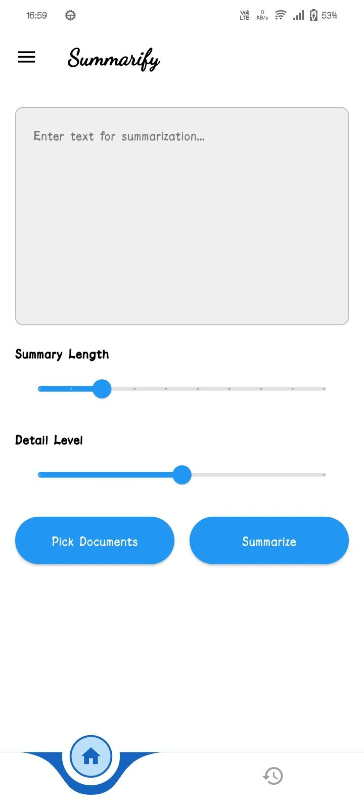
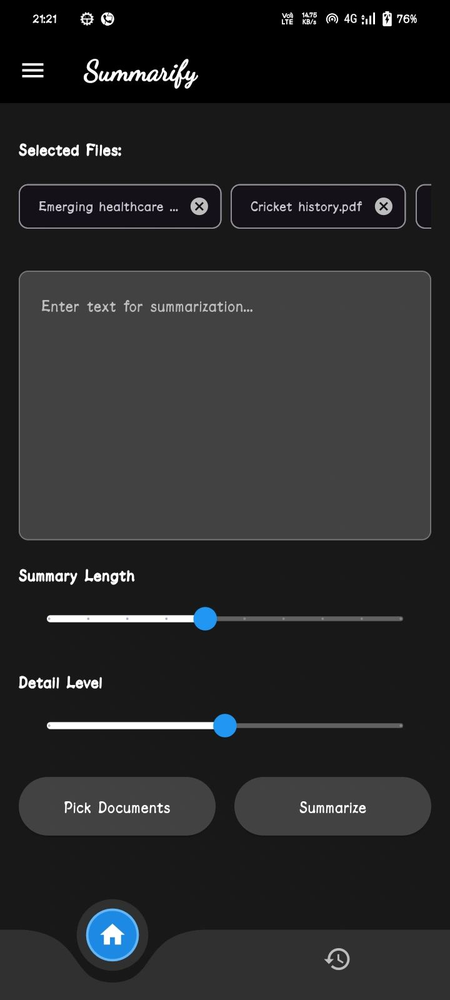
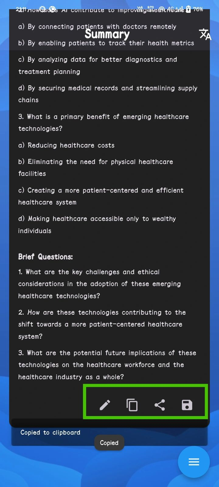
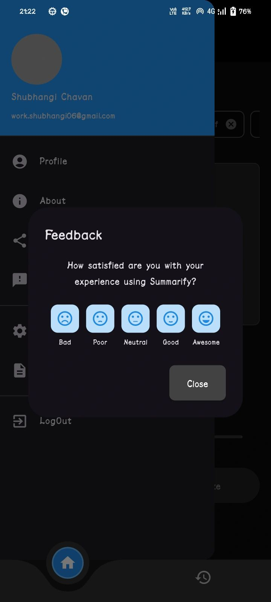
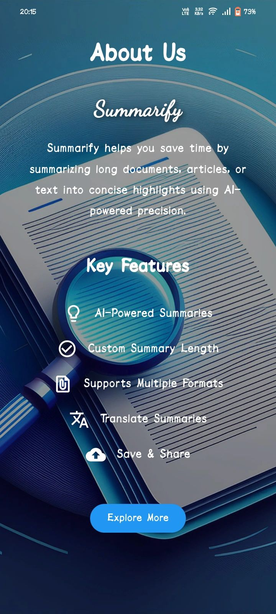

# Summarify: AI-Powered Document Management

## Overview

Summarify is an AI-powered solution designed to automate document management by providing features like document upload, advanced text summarization, question generation, and seamless document handling. By leveraging the Gemini AI model, Summarify helps users extract key insights, improve understanding, and enhance productivity in various industries such as academia, law, and corporate sectors. The platform integrates secure storage, document translation, and real-time synchronization with Firebase.

## Features

- **Multiple Document Upload**: Upload multiple documents at once (TXT, PDF, DOC, and PPT files) through the Flutter app.
- **AI-Powered Processing**: Gemini AI generates summaries and relevant questions from uploaded documents.
- **Summarization & Question Generation**: Extracts key points and generates insightful questions based on the document’s content.
- **Real-Time Sync**: Firebase ensures that all changes and updates are instantly synced across devices.
- **Multi-Language Translation**: Translates summarized content into various languages for easier sharing and collaboration.
- **Data Storage**: Securely stores the original documents, summaries, and questions in Firebase Firestore.
- **Frontend Display**: Displays the summarized content, generated questions, and original documents in an intuitive Flutter app interface.
- **Batch Processing**: Supports processing multiple documents simultaneously, providing a more efficient workflow for users.

## Background

In today’s information-driven world, organizations and individuals are often overwhelmed by the need to process large volumes of text, whether for research, compliance, or documentation. Summarify was developed to streamline this process and reduce the time spent on manual document review. By using the Gemini AI model, Summarify offers automated summarization, question generation, and translation features, saving users valuable time and enhancing productivity.

## Objective

The primary goal of Summarify is to simplify document management, making it easier for users to interact with complex documents. The AI-powered tool automates the extraction of important content, generates questions for better comprehension, and provides intuitive navigation for users to handle documents efficiently.

## Scope and Purpose

### Scope

Summarify covers the full lifecycle of document management, from upload and parsing to summarization and question generation. The application supports multiple document formats (TXT, PDF, DOC, PPT) and ensures secure storage and retrieval of data. Additionally, the application is designed to synchronize updates across devices in real-time using Firebase.

### Purpose

Summarify aims to:

- Enhance productivity by automating document summarization and question generation.
- Provide an intuitive interface for better user experience and content management.
- Improve document interactions by offering multi-language translations for global users.
- Support batch processing of multiple documents for improved efficiency.

## Workflow

1. **Document Upload**: Users upload multiple documents via the Flutter app.
2. **Backend Processing**: The Python backend processes all uploaded documents using the Gemini AI model.
3. **Summarization & Question Generation**: Gemini AI generates summaries and related questions for each document.
4. **Data Storage**: The results, including summaries and questions, are stored securely in Firebase Firestore.
5. **Frontend Display**: Summarized content, questions, and original documents are retrieved and displayed in the app.
6. **Real-Time Sync**: Firebase ensures instant updates and synchronization across devices.

## Tech Stack

- **Frontend**: Flutter
- **Backend**: Python (Gemini AI for processing)
- **Database**: Firebase Firestore
- **Real-Time Sync**: Firebase

## Setup

### Prerequisites

1. Flutter SDK installed: [Install Flutter](https://flutter.dev/docs/get-started/install)
2. Firebase project: Set up a Firebase project [here](https://firebase.google.com/docs/flutter/setup)
3. Python: Ensure Python is installed for backend processing.

### Frontend Setup

1. Clone the repository:
   ```bash
   git clone https://github.com/your-repo/summarify.git
   cd summarify
   
2. Install Flutter dependencies:
   ```bash
   flutter pub get

3. Set up Firebase in your Flutter app: Follow the instructions here to link your Firebase project with your Flutter app.

### Backend Setup

1. Install the required dependencies: Ensure that Python is installed on your machine and that the necessary libraries are available. Install dependencies for the backend:

   ```bash
   pip install -r requirements.txt

2. Ensure the backend (Gemini AI model) is properly configured: The backend should be set up to process uploaded documents using the Gemini AI model. This includes integrating the Firebase Firestore with the backend to store documents, summaries, and questions securely.

3. Start the backend server: Start the backend server to handle document processing and syncing with Firebase:

   ```bash
   python app.py

### Running the App

1. Run the Flutter app:

   ```bash
   flutter run

2. Upload multiple documents and interact with the summarized content and questions in real-time.

###Summarify Images:

## Screenshots of Summarify

### Main Screens

<div style="display: flex; flex-wrap: wrap;">
  
  
  
  
  
  
</div>

### Additional Features

<div style="display: flex; flex-wrap: wrap;">
  
  
  
  
  
</div>

### Other Screens

<div style="display: flex; flex-wrap: wrap;">
  
  
</div>
